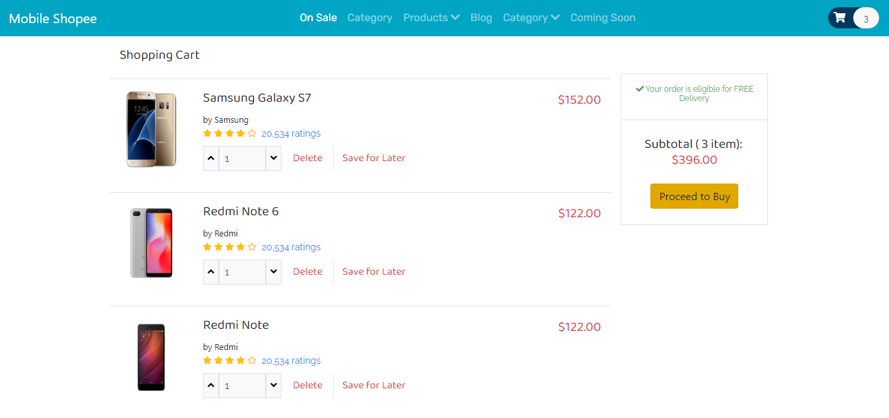

# Mobile_Shopee-E-Commerce-Website
This is a responsive full Shopping website built with HTML, CSS, JAVASCRIPT, PHP and MYSQL.
It contains filter list between different brands of phones,

How to use
1 download files from github
2 Open xampp
3 Open mysql
4 create new database called shopee
5 import database from "database/shopee.sql" 
6 copy and paste in a browser "http://localhost/Mobile_Shopee-E-Commerce-Website-master/"

I took on the project of creating a "School Management System," a comprehensive platform that simplified and automated various administrative tasks for educational institutions based in Lagos, Nigeria. The system aimed to foster academic excellence by providing seamless communication and collaboration between all stakeholders, including administrators, teachers, students, and parents.

To achieve this goal, I utilized a full-stack approach, combining Javascript, PHP, and SQL to develop a robust and efficient CMS (Content Management System) tailored to the institution's specific needs. By leveraging the power of these technologies, I ensured the system's responsiveness, scalability, and security.

One of the significant challenges was to create an intuitive and user-friendly interface that catered to each user's unique requirements. I addressed this challenge by designing and developing distinct user interfaces for administrators, teachers, students, and parents. Each interface was tailored to their roles and responsibilities, making it easy for them to navigate through the system and access the necessary information effortlessly.

Throughout the development process, I maintained a strong focus on streamlining administrative tasks. The CMS allowed for seamless management of student records, timetables, attendance, and academic progress. Teachers could easily upload and grade assignments, while students and parents had convenient access to view their grades, schedules, and other important information.

The successful completion of the School Management System significantly improved the institution's efficiency and effectiveness. Administrative tasks that once consumed considerable time were now streamlined, allowing staff to dedicate more time to educational and student-related matters. Additionally, the intuitive user interface received positive feedback from all users, making it easier for them to engage with the system effectively.

Overall, this project showcased my ability to design and develop full-stack solutions that cater to specific organizational needs, highlighting my expertise in Javascript, PHP, and SQL. It was a gratifying experience to contribute to the improvement of an educational institution, positively impacting the academic journey of countless students and educators.
